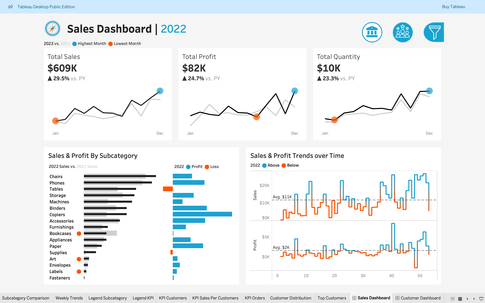
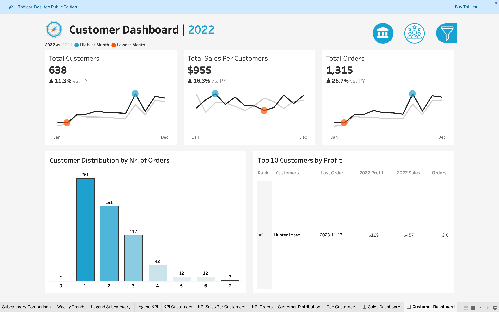
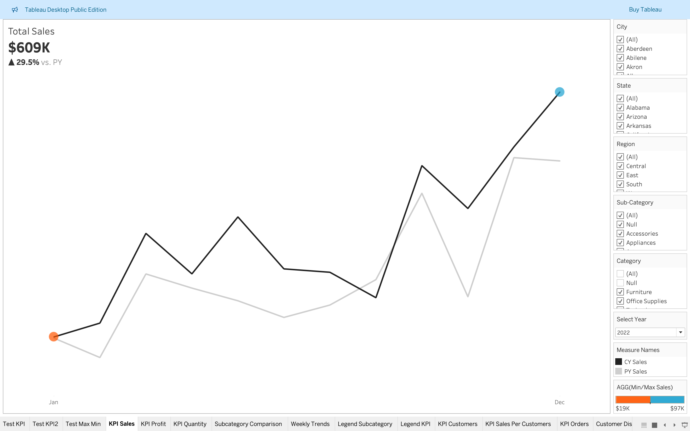
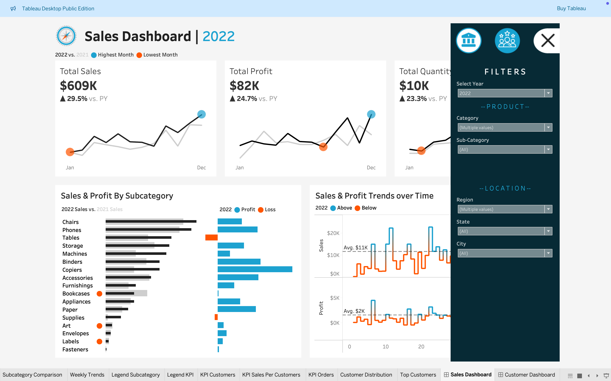

# Sales and Customer Analytics Dashboard

## Overview
The Sales and Customer Analytics Dashboard is an interactive Tableau project designed to provide actionable insights into sales performance and customer behavior. This dashboard is ideal for businesses looking to monitor KPIs, analyze trends, and make data-driven decisions efficiently.

### Link to Dashboard
Access the live dashboard here: [Sales and Customer Analytics Dashboard](https://public.tableau.com/app/profile/jay.gaudani/viz/SalesCustomerDashboardsDynamic_17377733061050/SalesDashboard?publish=yes)

### Video Walkthrough
Watch the recorded walkthrough for an in-depth demonstration of the dashboard's features and functionalities:

---

## Features

1. **Dynamic Visualizations:**
   - Interactive charts and graphs for sales trends, revenue growth, and performance comparisons.
   - 

2. **Customer Insights:**
   - Filters for customer demographics, purchase behaviors, and feedback.
   - 

3. **KPIs and Metrics:**
   - Real-time tracking of key performance indicators such as:
     - Total Sales
     - Revenue by Region
     - Customer Retention Rate
   - 

4. **Filters and Drilldowns:**
   - Dynamic filtering for dates, regions, products, and customer categories to personalize analysis.
   - 

---

## How to Use the Dashboard

1. **Navigate to the Dashboard**
   Open the [Sales and Customer Analytics Dashboard](https://public.tableau.com/app/profile/jay.gaudani/viz/SalesCustomerDashboardsDynamic_17377733061050/SalesDashboard?publish=yes) link in your browser.

2. **Interact with Filters**
   - Use the filters on the right-hand side to focus on specific timeframes, products, or customer segments.

3. **Explore Visuals**
   - Hover over charts for detailed insights.
   - Click on data points to drill down further.

4. **Download or Share**
   - Export visuals or share the dashboard link for collaborative use.

---

## Technical Details

- **Platform:** Tableau Public
- **Data Source:** Simulated business data (sales and customer data)
- **Key Tools Used:**
  - Tableau for data visualization
  - Advanced filters and calculated fields for customization

---

## Contact
For any questions or collaboration opportunities, feel free to reach out:

**Jay Gaudani**  
**Email:** [jaybhgaudani2002@gmail.com](mailto:jaybhgaudani2002@gmail.com)  
**LinkedIn:** [Jay Gaudani](https://www.linkedin.com/in/jay-gaudani-5826141b6/)

---

Enhance your business decisions with powerful insights from this dashboard.
